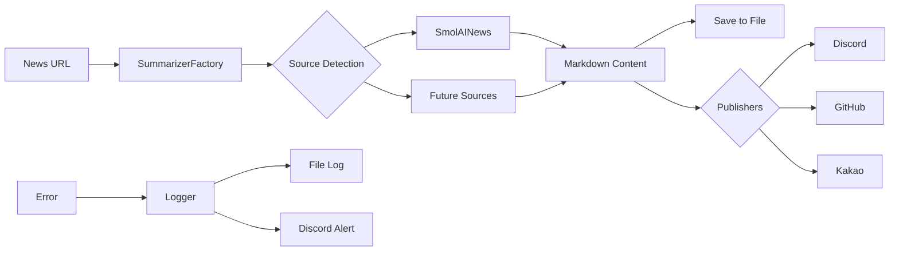

# News Bot Architecture

## 개요
확장 가능한 뉴스 요약 생성 및 다중 플랫폼 배포 시스템의 아키텍처 문서입니다.
다양한 뉴스 소스를 지원하며, 새로운 소스와 배포 채널을 쉽게 추가할 수 있는 구조로 설계되었습니다.

## 시스템 구조

```
news_bot/
├── src/                    # 소스 코드 디렉토리
│   ├── __init__.py
│   ├── config.py          # 환경변수 및 설정 관리
│   ├── logger.py          # 로깅 시스템
│   ├── notifier.py        # 에러 알림 시스템
│   ├── summarizer.py      # Summarizer Factory
│   ├── markdown_utils.py  # 마크다운 처리 유틸리티
│   ├── summarizers/       # 요약 생성 모듈
│   │   ├── __init__.py
│   │   ├── base.py        # BaseSummarizer 추상 클래스
│   │   └── smol_ai_news.py # Smol AI News 전용 Summarizer
│   └── publishers/        # 배포 채널 모듈
│       ├── __init__.py
│       ├── base.py        # BasePublisher 추상 클래스
│       ├── discord.py     # Discord 웹훅 배포
│       ├── github.py      # GitHub Discussions 배포
│       └── kakao.py       # 카카오톡 봇 배포
├── logs/                  # 로그 파일 저장
│   └── .gitkeep
├── main.py               # CLI 진입점
├── requirements.txt      # 의존성 패키지
├── .env.example         # 환경변수 템플릿
├── ARCHITECTURE.md      # 이 문서
└── README.md            # 사용 가이드

```

## 모듈 상세 설명

### 1. Core Modules

#### config.py
- **역할**: 모든 환경변수 중앙 관리
- **주요 기능**:
  - 환경변수 로드 및 검증
  - 필수/선택 설정 구분
  - 기본값 제공
- **환경변수**:
  - `OPENAI_API_KEY`: OpenAI API 키 (필수)
  - `OPENAI_MODEL`: 사용할 모델 (기본: gpt-4o)
  - `DISCORD_WEBHOOK_URL`: Discord 알림 URL
  - `GITHUB_TOKEN`: GitHub API 토큰
  - `GH_REPO`: GitHub 저장소 (owner/repo)
  - `GH_DISCUSSION_CATEGORY`: Discussion 카테고리
  - `KAKAO_BOT_WEBHOOK_URL`: 카카오톡 봇 웹훅
  - `ERROR_DISCORD_WEBHOOK_URL`: 에러 알림용 Discord URL

#### logger.py
- **역할**: 애플리케이션 전체 로깅 시스템
- **주요 기능**:
  - 날짜별 로그 파일 로테이션
  - 로그 레벨별 처리 (DEBUG, INFO, WARNING, ERROR)
  - 에러 발생 시 자동 Discord 알림 연동
  - 컨솔 및 파일 동시 출력
- **로그 형식**: `[YYYY-MM-DD HH:MM:SS] [LEVEL] [MODULE] Message`

#### notifier.py
- **역할**: 에러 및 중요 이벤트 알림
- **주요 기능**:
  - Discord 웹훅으로 에러 상세 전송
  - 스택 트레이스 포함
  - 에러 레벨별 색상 구분
  - 발생 시간 및 환경 정보 포함

#### summarizer.py
- **역할**: Summarizer Factory 패턴 구현
- **주요 기능**:
  - 뉴스 소스에 따른 적절한 Summarizer 선택
  - URL 기반 자동 Summarizer 감지
  - 새로운 Summarizer 등록 및 관리
  - 하위 호환성 지원
- **주요 클래스**:
  - `NewsSource`: 지원하는 뉴스 소스 Enum
  - `SummarizerFactory`: Factory 클래스
  - `Summarizer`: 하위 호환성을 위한 래퍼

### 2. Summarizers (요약 생성 모듈)

#### summarizers/base.py
- **역할**: Summarizer 인터페이스 정의
- **주요 클래스**:
  ```python
  class BaseSummarizer(ABC):
      @abstractmethod
      def summarize(self, url: str, **kwargs) -> str:
          pass
      
      @abstractmethod
      def get_supported_domains(self) -> list[str]:
          pass
  ```
- **확장성**: 새로운 뉴스 소스 추가 시 이 인터페이스 구현

#### summarizers/smol_ai_news.py
- **역할**: Smol AI News 전용 요약 생성
- **주요 기능**:
  - OpenAI Responses API 호출
  - web_search 도구 활용
  - AI Twitter/Reddit/Discord Recap 섹션 추출
  - 한국어 마크다운 형식 요약
  - 재시도 로직 및 에러 처리
- **내장 프롬프트**:
  - `SYSTEM_PROMPT`: 기본 역할 및 규칙
  - `DEVELOPER_PROMPT`: 출력 형식 지정
  - `TODAY_SUMMARY_PROMPT`: 오늘의 요약 옵션

#### markdown_utils.py
- **역할**: 마크다운 문서 처리
- **주요 기능**:
  - 파일 읽기/쓰기
  - 섹션 추출 (예: "오늘의 요약")
  - 헤더 파싱
  - 마크다운 검증

### 3. Publishers (배포 모듈)

#### publishers/base.py
- **역할**: Publisher 인터페이스 정의
- **주요 클래스**:
  ```python
  class BasePublisher(ABC):
      @abstractmethod
      def publish(self, content: str, **kwargs) -> bool:
          pass
      
      @abstractmethod
      def validate_config(self) -> bool:
          pass
  ```
- **확장성**: 새로운 플랫폼 추가 시 이 인터페이스 구현

#### publishers/discord.py
- **역할**: Discord 웹훅 배포
- **주요 기능**:
  - 2000자 제한 자동 청크 분할
  - 멘션 태그 지원
  - 임베드 메시지 옵션
  - 전송 실패 시 재시도

#### publishers/github.py
- **역할**: GitHub Discussions 게시
- **주요 기능**:
  - GraphQL API 사용
  - 카테고리 자동 탐색
  - Discussion 생성 및 URL 반환
  - 마크다운 형식 유지

#### publishers/kakao.py
- **역할**: 카카오톡 봇 메시지 발송
- **주요 기능**:
  - "오늘의 요약" 섹션 자동 추출
  - 1000자 제한 처리
  - 커스텀 웹훅 지원

### 3. Main Entry Point

#### main.py
- **역할**: CLI 인터페이스
- **주요 기능**:
  - argparse를 통한 명령줄 파라미터 처리
  - 파이프라인 조율
  - 에러 처리 및 로깅 초기화
- **CLI 옵션**:
  - `--url`: 뉴스 URL (필수)
  - `--source`: 뉴스 소스 타입 (선택, 기본: URL에서 자동 감지)
  - `--timeframe`: 기간 정보
  - `--out`: 출력 파일 경로
  - `--title`: GitHub Discussion 제목
  - `--send-discord`: Discord 발송 플래그
  - `--send-github`: GitHub 게시 플래그
  - `--send-kakao`: 카카오톡 발송 플래그
  - `--send-all`: 모든 채널로 발송
  - `--debug`: 디버그 모드
  - `--dry-run`: 실제 발송 없이 시뮬레이션

## 데이터 흐름



## 에러 처리 전략

1. **로깅 레벨**:
   - DEBUG: 상세 디버깅 정보
   - INFO: 일반 실행 정보
   - WARNING: 경고 (계속 실행 가능)
   - ERROR: 에러 (Discord 알림 발송)

2. **에러 격리**:
   - 각 Publisher는 독립적으로 실행
   - 하나의 실패가 다른 채널에 영향 없음

3. **알림 정책**:
   - ERROR 레벨 이상만 Discord 알림
   - 스택 트레이스 전체 포함
   - 발생 시간 및 모듈 정보 제공

## 확장 가이드

### 새로운 Summarizer 추가하기

1. `src/summarizers/` 디렉토리에 새 파일 생성
2. `BaseSummarizer` 클래스 상속
3. `summarize()`, `validate_config()`, `get_supported_domains()` 메서드 구현
4. `src/summarizer.py`의 `NewsSource` Enum에 새 소스 추가
5. `SummarizerFactory._summarizers`에 등록

예시:
```python
# src/summarizers/hacker_news.py
from .base import BaseSummarizer

class HackerNewsSummarizer(BaseSummarizer):
    def __init__(self, api_key: Optional[str] = None, model: Optional[str] = None):
        super().__init__("Hacker News", api_key, model)
    
    def summarize(self, url: str, **kwargs) -> str:
        # Hacker News 요약 로직
        pass
    
    def get_supported_domains(self) -> list[str]:
        return ['news.ycombinator.com', 'hackernews.com']
```

### 새로운 Publisher 추가하기

1. `src/publishers/` 디렉토리에 새 파일 생성
2. `BasePublisher` 클래스 상속
3. `publish()` 및 `validate_config()` 메서드 구현
4. `main.py`에 CLI 옵션 추가

예시:
```python
# src/publishers/slack.py
from .base import BasePublisher

class SlackPublisher(BasePublisher):
    def __init__(self, webhook_url: str):
        self.webhook_url = webhook_url
    
    def publish(self, content: str, **kwargs) -> bool:
        # Slack 발송 로직
        pass
    
    def validate_config(self) -> bool:
        return bool(self.webhook_url)
```

## 보안 고려사항

1. **API 키 관리**:
   - 모든 키는 환경변수로 관리
   - `.env` 파일은 git에서 제외
   - `.env.example` 제공

2. **에러 메시지**:
   - 민감한 정보 필터링
   - 프로덕션 환경에서는 스택 트레이스 제한

3. **네트워크 요청**:
   - 타임아웃 설정 (30초)
   - 재시도 횟수 제한

## 성능 최적화

1. **로깅**:
   - 비동기 로깅 고려 (대용량 처리 시)
   - 로그 로테이션으로 디스크 관리

2. **API 호출**:
   - 동시 발송은 순차 처리 (안정성 우선)
   - 실패 시 exponential backoff

3. **메모리 관리**:
   - 큰 마크다운 파일 스트리밍 처리
   - 청크 단위 전송

## 테스트 전략

1. **단위 테스트** (향후 구현):
   - 각 모듈 독립 테스트
   - Mock을 활용한 외부 의존성 격리

2. **통합 테스트**:
   - 실제 API 호출 테스트 (테스트 환경)
   - 엔드-투-엔드 파이프라인 검증

## 버전 관리

- 시맨틱 버저닝 사용 (MAJOR.MINOR.PATCH)
- 변경 사항은 CHANGELOG.md에 기록
- Git 태그로 릴리스 관리